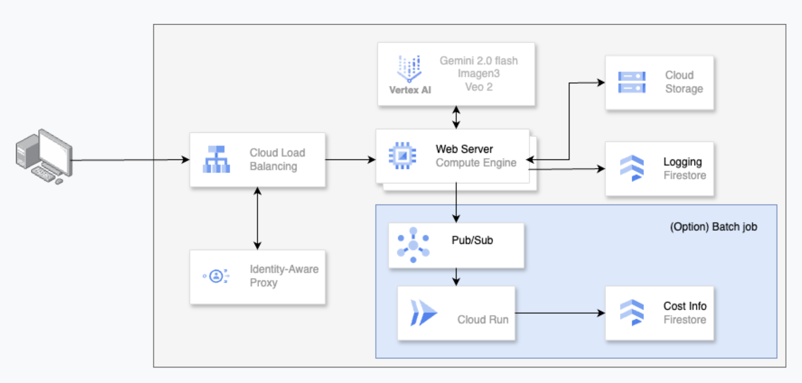

# Google Cloud AI Generative Models Demo

This Streamlit application showcases various generative AI capabilities offered by Google Cloud's Vertex AI and GenAI services, including text-to-image generation, image upscaling, image editing, image-to-video generation, and text-to-video generation. It also provides a history of your API calls.

## Features

* **Text to Image:** Generate images from textual prompts using the Imagen 3 model. Includes an optional prompt optimization feature powered by Gemini.
* **Enlarge Image:** Upscale uploaded images by a factor of x2 or x4 without significant quality loss using Imagen 3. Supports processing multiple images.
* **Edit Image:** Modify uploaded images based on textual prompts, leveraging subject and control image features of Imagen 3.
* **Image to Video:** Create videos from uploaded images with a descriptive text prompt using the Veo 2 model.
* **Text to Video:** Generate videos directly from textual prompts using the Veo 2 model.
* **My Collections:** View a history of your API calls, including the type of operation, the prompt used (if applicable), the timestamp, and the generated video path (if applicable). This data is stored in a Firestore database.
* **Video Analysis & Batch Video Analysis:** (Currently TBD - To Be Developed)

## Getting Started

### Prerequisites

* A Google Cloud Project with the Vertex AI API and Cloud Storage API enabled.
* Ensure your Google Cloud project ID is correctly configured in the `PROJECT_ID` variable in the code.
* For accessing Firestore, the Google Compute Engine (GCE) instance running this application should have the necessary service account permissions. If running locally or outside GCE with ADC, ensure your credentials are set up correctly.
* For video generation, a Google Cloud Storage bucket (`gcs_uri`) is required to store the output videos. Update the `gcs_uri` variable with your bucket URL.

### Running the Application

1.  **Clone the repository:**
    ```bash
    git clone <repository_url>
    cd <repository_directory>
    ```
2.  **Install the required Python libraries:**
    ```bash
    pip install -r requirements.txt
    ```
    *(Note: A `requirements.txt` file is not provided in the code. You'll need to create one with the following dependencies based on the import statements in your Python code):*
    ```
    streamlit
    streamlit-pdf-viewer
    google-cloud-storage
    google-cloud-pubsub
    google-cloud-firestore
    pandas
    vertexai
    google-generativeai
    requests
    google-auth
    ```
3.  **Set the Google Cloud Project ID environment variable (if not directly in the code):**
    ```bash
    export GOOGLE_CLOUD_PROJECT="your-project-id"
    ```
4.  **Run the Streamlit application:**
    ```bash
    streamlit run your_script_name.py
    ```
    *(Replace `your_script_name.py` with the actual name of your Python file.)*

5.  **Access the application in your web browser** at the URL provided by Streamlit (usually `http://localhost:8501`).

## Configuration

* **`PROJECT_ID`:** You must replace `"xxxxxxxxxxxxxxx"` with your actual Google Cloud Project ID in the Python script. It also attempts to read this from the `GOOGLE_CLOUD_PROJECT` environment variable.
* **`LOCATION`:** The default location is set to `"us-central1"`, and it can be overridden by the `GOOGLE_CLOUD_REGION` environment variable.
* **Firestore:** The application attempts to initialize the Firestore client using Google Cloud's Automatic Discovery of Credentials (ADC) when running on GCE. Ensure your GCE instance has the necessary permissions for the `yuchizh-test-449107` project. If initialization fails, a warning/error will be displayed.
* **`gcs_uri`:** Update `"gs://xxxxxxxxxxxxxxx"` with the Google Cloud Storage bucket URI where generated videos will be stored.

## Usage

The application features a sidebar with a dropdown menu to select different functionalities:

* **Text to Image:** Enter a text prompt in the sidebar and click "Generate" to create an image. You can also try the "improve your prompt" button for potential enhancements. Configure the number of images and the aspect ratio.
* **Enlarge Image:** Upload one or more image files, select the upscale factor (x2 or x4), and click "Upscale the Image" to generate higher-resolution versions. Download buttons will appear for each upscaled image.
* **Edit Image:** Upload an image, provide a description of the uploaded image and a text prompt for editing, and configure options like person generation and prompt enhancement. Click "Edit the Image" to generate the edited image.
* **Image to Video:** Upload an image and provide a short text prompt describing the desired motion. Configure the frame aspect ratio, frames per second (FPS), video duration, and other options. Click "Generate Videos" to start the video generation process. The generated video will be displayed upon completion.
* **Text to Video:** Enter a detailed text prompt describing the video you want to generate. Configure the aspect ratio, FPS, video duration, and other options. Click "Generate" to start the video generation. The generated video will be displayed upon completion.
* **My Collections:** This section displays a table of your past API calls, showing the operation type, the prompt used, the timestamp of the call, and a link to the generated video (if applicable). Note that costs are estimated and the actual billing may vary.
* **Video Analysis & Batch Video Analysis:** These sections are currently under development.

## Logging

The application uses Python's `logging` module to record information and errors to the `/PATH_TO_YOUR_LOG_FILE/app.log` file. **Remember to replace `/PATH_TO_YOUR_LOG_FILE/` with the actual path where you want to store the log file.**

## Firestore Logging

The application logs API call events (username, timestamp, API type, and details) to a Firestore collection named `api_calls_log`. This functionality requires the Firestore client to be initialized successfully. If initialization fails, logging to Firestore will be skipped.

## Google Cloud Storage Interaction

The application interacts with Google Cloud Storage for:

* Uploading images for upscaling and editing.
* Storing and displaying generated videos.

Ensure that the necessary permissions are granted to the service account or user credentials used to run this application to access the specified GCS bucket.

## Pub/Sub Integration

The code includes a function `publish_to_pubsub`, but it is not actively used in the current UI logic. It demonstrates how to publish messages to a Google Cloud Pub/Sub topic.

## Error Handling

The application includes basic error handling for API calls and file operations. Errors are displayed in the Streamlit UI and logged to the specified log file.

## Notes

* The "improve your prompt" feature uses the `gemini-2.0-flash` model, which might incur costs based on your Google Cloud pricing.
* Video generation can take a significant amount of time. The application polls the operation status every 15 seconds.
* The "My Collections" feature relies on successful Firestore initialization and assumes that API call logs are being correctly written to the `api_calls_log` collection. You might need to create an index on the `username` and `timestamp` fields in your Firestore collection for efficient querying, especially if you have a large number of logs.
* The styling of the application is defined using Markdown and custom CSS.
* The application attempts to retrieve the logged-in user's email from the `X-Goog-Authenticated-User-Email` header. If this header is not found, the user ID will be set to "unknown\_no\_headers".

This README provides a comprehensive overview of the Streamlit application and its functionalities. Remember to configure the necessary Google Cloud settings and install the required libraries before running the application.
